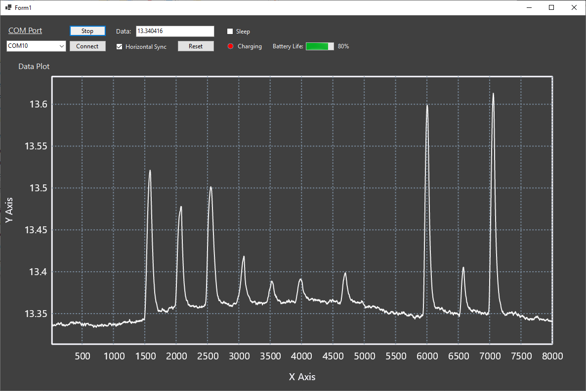

# TOF
Software Repository for Train Of Four Device

Folders: 
- Firmware_Operational_V1 - Current operational firmware for the pressure sensor board
- Firmware_Functionality_Tests - Place to store simple sketches to test board functionality (LEDs, Bluetooth, Sensors, etc)
- GUI_Build - Visual Studio 2022 files for the installable application. 
- GUI_Executable - Exe for the Testing application

GUI Screenshot:

